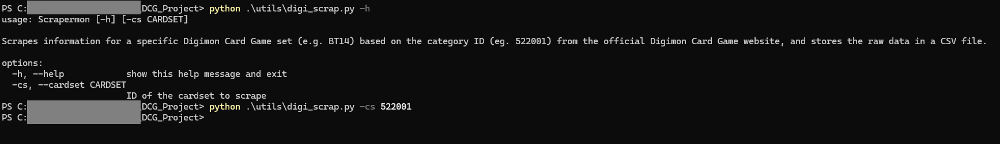
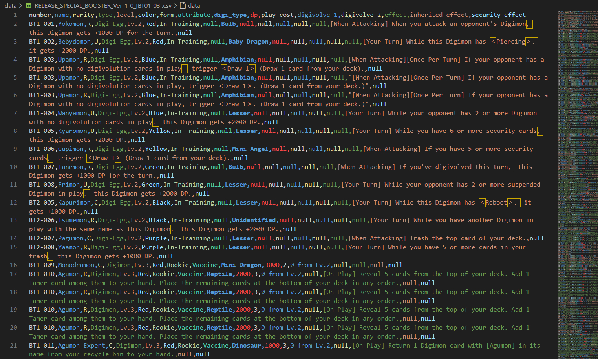

# 🃏 Digimon Card Set Scraper

This Python script scrapes information for a specific **Digimon Card Game set** (e.g., BT14) based on the category ID (eg., 522001) from the [official Digimon Card Game website](https://world.digimoncard.com/), and stores the raw data in a CSV file.

---

## 📌 Features

- Scrapes all cards from a given set with their attributes (Number, Rarity, Type, Level, Color, Form, Attribute, Digi_type, Dp, Play_cost, Digivolve_1, Digivolve_2, Effect, Inherited_effect, Security_effect).
- Supports export to CSV.
- Simple and beginner-friendly codebase for learning web scraping.

---

## 📁 Example Output

**digifile.csv**
```csv
number,rarity,type,level,color,form,attribute,digi_type,dp,play_cost,digivolve_1,digivolve_2,effect,inherited_effect,security_effect
"<li class=""cardno"">BT1-001</li>",<li>R</li>,"<li class=""cardtype"">Digi-Egg</li>","<li class=""cardlv"">Lv.2</li>","<dd class=""cardColor"">
<span class=""cardColor_red"">Red</span>
</dd>",<dd>In-Training</dd>,<dd>-</dd>,<dd>Bulb</dd>,<dd>-              </dd>,<dd>-</dd>,<dd>-</dd>,<dd>-</dd>,<dd>-</dd>,<dd>[When Attacking] When you attack an opponent's Digimon， this Digimon gets +1000 DP for the turn.</dd>,<dd>-</dd>
...
```

---

## 🔧 Requirements

- Python 3.13+
- Libraries:
  - `requests`
  - `beautifulsoup4`
  - `dotenv`

Install dependencies:
```bash
pip install -r requirements.txt
```

---

## 🚀 How to Use

Modify the category ID defined on the __main__ method and then run the script:
```bash
python digi_scrap.py
```

---

## 🧠 How It Works

1. The script accesses the Digimon card list page for the specified set.
2. It parses the HTML received.
3. It extracts structured data like:
    - Number.
    - Rarity.
    - Type.
    - Level.
    - Color.
    - Form.
    - Attribute.
    - Digi_type.
    - Dp.
    - Play_cost.
    - Digivolve_1.
    - Digivolve_2.
    - Effect.
    - Inherited_effect.
    - Security_effect.
4. The data is saved to the digifile.csv file.

---

## 🖼️ Screenshot





---

## ⚠️ Disclaimer

This project is for educational and recreational use only. I do not own any of the data or content sourced from the website, and no commercial benefit is intended or derived from its use.

---

## 📚 TODOs

- [ ] Add unit tests
- [ ] Add support for scraping multiple sets in one run
- [ ] Include card images in the dataset

---

## 🤝 Contributing

At the moment, this project is not accepting pull requests. However, feel free to fork the repository and modify it for your personal or educational use.

---

## 📄 License

GLP License – see the [LICENSE](LICENSE) file for details.
